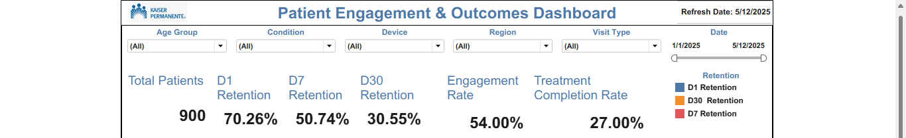
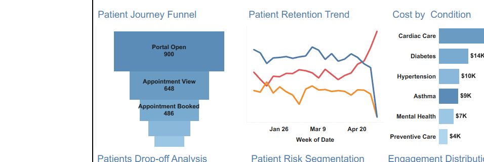
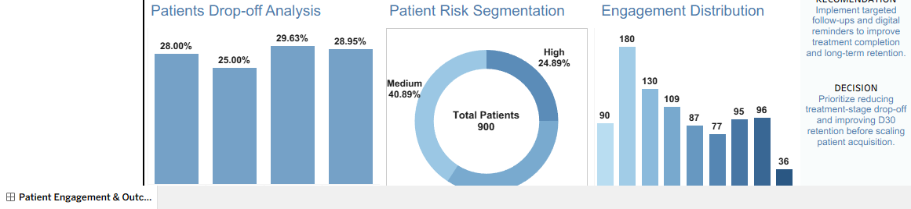

# Patient Engagement & Outcomes Dashboard

## Executive Summary

This project analyzes patient engagement, journey drop-off, treatment completion, retention, and cost patterns to help healthcare and digital product teams improve long-term patient outcomes.

The dashboard evaluates **D1/D7/D30 retention, engagement rate, treatment completion rate, patient journey conversion, treatment cost, risk segmentation, and condition-level performance** to identify where patients disengage after initial portal activity.

Insights from this analysis support decisions around targeted follow-up, digital reminder programs, retention interventions, and treatment-completion improvement.

Expected impact includes improving D30 retention by **5–10%**, increasing treatment completion by **4–8%**, reducing avoidable drop-off by **6–12%**, and helping care teams prioritize high-risk patient segments before scaling acquisition efforts.

Built using **Tableau, SQL, Python, and Streamlit**.

---

## Business Problem

Healthcare teams often acquire patients into digital care journeys, but many patients disengage before completing treatment. This creates operational waste, lower care continuity, and weaker long-term outcomes.

This project answers:

- Where are patients dropping off in the care journey?
- Which retention period is weakest: D1, D7, or D30?
- Which patient conditions and risk groups drive cost and engagement issues?
- What decision should leadership make to improve completion and retention?

---

## KPI Goals

| KPI | Value | Business Purpose |
|---|---:|---|
| Total Patients | 900 | Measures patient population analyzed |
| D1 Retention | 63.33% | Measures early engagement after first interaction |
| D7 Retention | 40.11% | Measures short-term patient stickiness |
| D30 Retention | 23.44% | Measures long-term care engagement |
| Engagement Rate | 43.67% | Measures digital interaction strength |
| Treatment Completion Rate | 27.00% | Measures care journey completion |
| Outcome Success Rate | 25.11% | Measures positive treatment outcome |
| Avg Treatment Cost | $286.22 | Measures financial exposure by completed treatment |

---

## Dataset Overview

| Item | Detail |
|---|---|
| Dataset | `patient_engagement.csv` |
| Rows | 2,619 |
| Columns | 21 |
| Date Range | 2025-01-01 to 2025-05-12 |
| Grain | Patient journey event level |
| Key Fields | Patient ID, Event, Funnel Stage, Journey Date, Condition, Region, Device Type, Visit Type, Retention Flags, Treatment Completed, Outcome Success, Engagement Score, Treatment Cost |
| Business Meaning | Tracks how patients move from portal engagement through appointment booking, consultation, treatment completion, follow-up, and outcome success |

---

## Dashboard Preview


### KPI Overview



### Journey / Trend View



### Segment / Risk View



---

## SQL Transformations

The repo includes recruiter-readable SQL queries that match the dashboard visuals.

### 1. KPI Summary Query

```sql
SELECT
    COUNT(DISTINCT patient_id) AS total_patients,
    AVG(d1_retained) AS d1_retention,
    AVG(d7_retained) AS d7_retention,
    AVG(d30_retained) AS d30_retention,
    AVG(treatment_completed) AS treatment_completion_rate,
    AVG(outcome_success) AS outcome_success_rate,
    AVG(engagement_score) / 10.0 AS engagement_rate
FROM patient_engagement;
```

### 2. Patient Journey Funnel Query

```sql
SELECT
    funnel_stage,
    funnel_stage_order,
    COUNT(DISTINCT patient_id) AS patients
FROM patient_engagement
GROUP BY funnel_stage, funnel_stage_order
ORDER BY funnel_stage_order;
```

### 3. Retention Trend Query

```sql
SELECT
    DATE_TRUNC('week', journey_date) AS week_of_date,
    AVG(d1_retained) AS d1_retention,
    AVG(d7_retained) AS d7_retention,
    AVG(d30_retained) AS d30_retention
FROM patient_engagement
GROUP BY 1
ORDER BY 1;
```

### 4. Cost by Condition Query

```sql
SELECT
    condition,
    AVG(treatment_cost) AS avg_treatment_cost,
    AVG(treatment_completed) AS treatment_completion_rate,
    AVG(outcome_success) AS outcome_success_rate
FROM patient_engagement
WHERE treatment_cost > 0
GROUP BY condition
ORDER BY avg_treatment_cost DESC;
```

---

## Metrics Engineering

| Metric | Formula |
|---|---|
| D1 Retention | D1 Retained Patients / Total Patients |
| D7 Retention | D7 Retained Patients / Total Patients |
| D30 Retention | D30 Retained Patients / Total Patients |
| Engagement Rate | Average Engagement Score / 10 |
| Treatment Completion Rate | Treatment Completed Patients / Total Patients |
| Outcome Success Rate | Outcome Success Patients / Total Patients |
| Drop-off Rate | 1 - Stage Conversion Rate |
| Avg Treatment Cost | Total Treatment Cost / Completed Treatments |

---

## Product Insights

### Insight
Patient drop-off is highest between consultation and treatment, while D30 retention remains much lower than early D1 retention. This suggests patients are entering the journey but not sustaining long-term engagement.

### Action
Analyze barriers preventing patients from completing treatment and re-engaging after initial visits, especially across high-cost conditions and high-risk segments.

### Recommendation
Implement targeted follow-ups, digital reminders, condition-specific outreach, and re-engagement campaigns for patients with low D30 retention signals.

### Decision
Prioritize reducing treatment-stage drop-off and improving D30 retention before scaling patient acquisition efforts.
---

## Experimentation Thinking

Potential healthcare experiments:

- Reminder notification timing
- Telehealth vs in-person follow-up
- High-risk patient intervention workflow
- Personalized care messaging
- Retention nudges for D30 patients

---

## Decision Framework

| Decision Signal | Rule | Action |
|---|---|---|
| Strong | High treatment completion + improving D30 retention | Scale engagement workflow |
| Promising | Good D1/D7 retention but weak D30 retention | Monitor and improve follow-up |
| Review | High cost + low completion | Investigate care barriers |
| At Risk | High drop-off + low outcome success | Prioritize intervention |

---

## Measurable Business Impact

This dashboard could help healthcare leadership:

- Improve D30 retention by **5–10%** through targeted follow-up programs.
- Increase treatment completion by **4–8%** by identifying the highest drop-off stages.
- Reduce avoidable patient journey drop-off by **6–12%** through funnel monitoring.
- Lower cost exposure by focusing intervention on high-cost conditions such as cardiac care and diabetes.
- Improve executive decision speed by consolidating retention, cost, risk, and engagement KPIs into one dashboard.

---

## Streamlit App

The Streamlit app recreates the Tableau dashboard with:

- KPI cards
- Patient journey funnel
- Retention trend
- Cost by condition
- Drop-off analysis
- Patient risk segmentation
- Engagement distribution
- Executive Decision Summary cards

Run locally:

```bash
pip install -r requirements.txt
streamlit run app/streamlit_app.py
```

---

## Repo Architecture

```text
Patient-Engagement-Outcomes-Dashboard/
├── app/
│   └── streamlit_app.py
├── dashboard/
│   └── tableau_dashboard_preview.png
├── data/
│   └── patient_engagement.csv
├── docs/
│   └── project_summary.md
├── notebooks/
│   ├── eda_cleaning_feature_engineering.ipynb
│   └── EDA_CLEANING_FEATURE_ENGINEERING.md
├── screenshots/
│   ├── dashboard_preview.png
│   ├── kpi_overview.png
│   ├── trend_or_funnel.png
│   └── segment_or_risk_view.png
├── sql/
│   └── patient_engagement_analysis.sql
├── .gitignore
├── README.md
└── requirements.txt
```

---

## Automation Awareness

Future production workflow could include scheduled SQL refreshes, Python validation scripts, automated Tableau extract refresh, and Streamlit deployment monitoring.

---

## Future Improvements

- Add predictive modeling for patients at risk of low D30 retention.
- Add cohort-level retention heatmaps by acquisition channel and device type.
- Add statistical testing for engagement interventions.
- Connect the workflow to Snowflake, Redshift, or BigQuery.
- Add automated data-quality checks before dashboard refresh.
