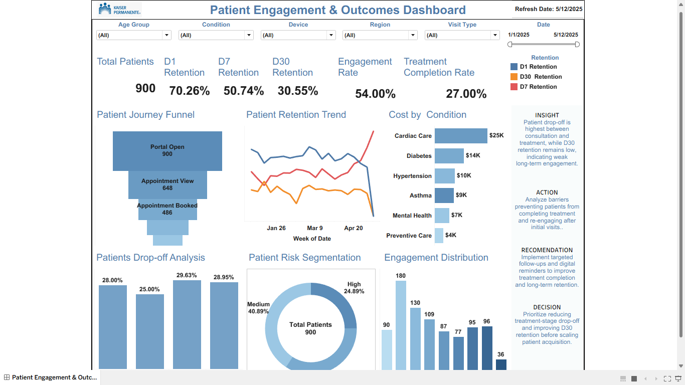

# Patient Engagement & Outcomes Dashboard

## Executive Summary

This repository presents a healthcare product analytics project focused on patient engagement, retention, treatment completion, journey drop-off, risk segmentation, and cost by condition. The Tableau dashboard turns patient interaction data into a decision-support view for healthcare leaders, care teams, and product stakeholders.

**Portfolio positioning:** Data Analyst (Healthcare & Tech) with Product Data Analytics skills.

**Core dashboard results:**

| KPI | Value |
|---|---:|
| Total Patients | 900 |
| D1 Retention | 63.33% |
| D7 Retention | 40.11% |
| D30 Retention | 23.44% |
| Engagement Rate | 25.22% |
| Treatment Completion Rate | 27.00% |
| Total Treatment Cost | $69,552 |

---

## Business Problem

Healthcare organizations often lose patients between portal engagement, appointment scheduling, consultation, treatment completion, and follow-up. When patient drop-off is not clearly measured, teams struggle to identify where intervention is needed and which patient groups require additional support.

This project answers:

- Where are patients dropping off in the care journey?
- Which conditions are driving the most treatment cost?
- How does retention change from D1 to D7 to D30?
- Which patients are at higher risk and need targeted outreach?
- What actions should the care team prioritize before scaling acquisition?

---

## KPI Goals

| KPI | Why It Matters |
|---|---|
| Total Patients | Measures population size and dashboard coverage |
| D1 / D7 / D30 Retention | Tracks short-term and long-term patient engagement |
| Engagement Rate | Measures active digital health participation |
| Treatment Completion Rate | Measures care journey completion effectiveness |
| Funnel Drop-off % | Identifies patient journey friction points |
| Risk Segmentation | Supports prioritization of outreach and intervention |
| Cost by Condition | Connects outcomes and engagement to financial impact |

---

## Dataset

The dataset contains patient-level journey events and healthcare engagement attributes.

**File:** `data/patient_engagement.csv`

Key fields include:

- Patient ID
- Event
- Journey Date
- Funnel Stage
- Funnel Stage Order
- Age Group
- Condition
- Visit Type
- Region
- Device Type
- Acquisition Channel
- Insurance Type
- Patient Risk Category
- D1 Retained, D7 Retained, D30 Retained
- Treatment Completed
- Follow-up Completed
- Outcome Success
- Engagement Score
- Treatment Cost

---

## SQL Transformations

SQL scripts are included to demonstrate analytics engineering workflow maturity:

| File | Purpose |
|---|---|
| `sql/patient_journey_funnel.sql` | Builds funnel counts and drop-off metrics |
| `sql/retention_analysis.sql` | Calculates D1, D7, and D30 retention metrics |
| `sql/cost_by_condition.sql` | Summarizes treatment cost by condition |
| `sql/risk_segmentation.sql` | Measures risk distribution and engagement outcomes |
| `sql/metrics_engineering.sql` | Creates executive KPI metrics |

---

## Metrics Engineering

This project uses patient-level aggregation to avoid double-counting because each patient can appear across multiple journey events.

Example metric logic:

```sql
COUNT(DISTINCT patient_id) AS total_patients
AVG(MAX(d1_retained)) AS d1_retention_rate
AVG(MAX(d7_retained)) AS d7_retention_rate
AVG(MAX(d30_retained)) AS d30_retention_rate
AVG(MAX(treatment_completed)) AS treatment_completion_rate
```

---

## Analytics Workflow

```text
Business Problem
        ↓
Dataset Understanding
        ↓
SQL Transformations
        ↓
Metrics Engineering
        ↓
Tableau Dashboard
        ↓
Product Insights
        ↓
Recommendations
        ↓
Decision Framework
        ↓
Business Impact
```

---

## Dashboard Preview



---

## Product Insights

1. **Patient drop-off is highest between consultation and treatment completion.**  
   This suggests that patients may need support after the consultation stage to complete treatment.

2. **D30 retention is much lower than D1 retention.**  
   Short-term engagement is stronger than long-term engagement, which means the care journey needs follow-up and reminder strategies.

3. **Cardiac Care and Diabetes drive the highest treatment cost.**  
   These areas should receive close monitoring because they carry both financial and outcome impact.

4. **Risk segmentation shows meaningful patient differences.**  
   High-risk and medium-risk patients require different engagement and intervention strategies.

---

## Experimentation Thinking

A practical experiment could test whether targeted follow-up reminders improve D30 retention and treatment completion.

**Experiment idea:**

| Item | Description |
|---|---|
| Control Group | Standard patient follow-up process |
| Variant Group | Personalized reminder and care navigation support |
| Primary Metric | D30 retention |
| Secondary Metric | Treatment completion rate |
| Guardrail Metrics | Cost per completed treatment, patient satisfaction, follow-up completion |
| Decision Rule | Ship if D30 retention and treatment completion improve without increasing cost per outcome |

---

## Recommendations

- Launch targeted follow-up reminders for patients after consultation.
- Prioritize intervention for high-risk patients and low-engagement segments.
- Monitor Cardiac Care and Diabetes because they represent high-cost condition groups.
- Improve digital touchpoints between appointment booking and treatment completion.
- Add operational alerts for patients who do not complete follow-up within the expected window.

---

## Decision Framework

| Decision Area | Recommendation |
|---|---|
| Patient Retention | Focus on improving D30 retention before scaling acquisition |
| Care Journey | Reduce friction between consultation and treatment completion |
| Cost Control | Monitor high-cost conditions with outcome-based interventions |
| Product Strategy | Use digital reminders and patient journey analytics to improve engagement |
| Operational Priority | Build care team workflows around high-risk patient segments |

---

## Business Impact

This dashboard supports:

- Better patient retention monitoring
- Faster identification of care journey drop-off
- More targeted patient outreach
- Improved treatment completion tracking
- Stronger alignment between healthcare outcomes and product analytics
- Better executive-level decisions around digital health engagement

---

## Streamlit App

A lightweight Streamlit app is included so the project can be viewed beyond Tableau.

Run locally:

```bash
pip install -r requirements.txt
streamlit run app/streamlit_app.py
```

---

## Repository Architecture

```text
patient-engagement-outcomes-dashboard/
│
├── data/
│   └── patient_engagement.csv
│
├── sql/
│   ├── patient_journey_funnel.sql
│   ├── retention_analysis.sql
│   ├── cost_by_condition.sql
│   ├── risk_segmentation.sql
│   └── metrics_engineering.sql
│
├── notebooks/
│   ├── eda.ipynb
│   └── kpi_analysis.ipynb
│
├── dashboard/
│   └── tableau_dashboard_placeholder.md
│
├── screenshots/
│   └── patient_engagement_dashboard.png
│
├── app/
│   └── streamlit_app.py
│
├── docs/
│   ├── business_case.md
│   ├── dashboard_guide.md
│   ├── kpi_definitions.md
│   └── experiment_plan.md
│
├── requirements.txt
├── .gitignore
└── README.md
```

---

## Automation Awareness

This project can be extended with a simple analytics pipeline:

1. Load patient engagement data
2. Validate key fields
3. Aggregate patient-level KPIs
4. Refresh dashboard-ready tables
5. Export results for Tableau or Streamlit

Recommended future automation tools:

- Python script for beginner-friendly automation
- Scheduled SQL jobs for warehouse-based refreshes
- Prefect for more advanced workflow orchestration

---

## Future Improvements

- Add real-time patient engagement alerts
- Add cohort retention heatmaps
- Add A/B testing readout page
- Add SHAP-based churn/risk model explanation
- Add automated KPI refresh pipeline
- Add Tableau packaged workbook when available
